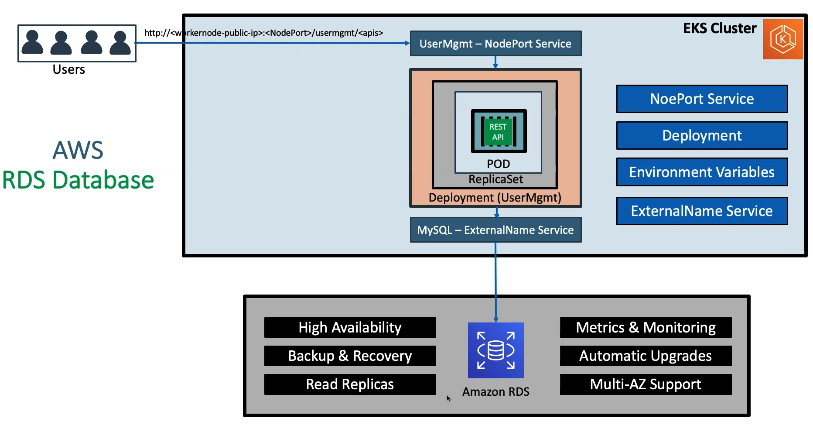

# EKS to RDS ExternalName Service 


- Draws back using EBS CSI Drivers for MySQL database
    - complex setup to achieve HA
    - complex multi-az support for EBS
    - Complex Master-Master MySQL setup
    - Comple Master-Slave MySQL setup
    - No automatic backup & Recovery
    - No Auto-Upgrade MySQL


```yaml
apiVesion: v1
kind: Service
metadata:
  name: mysql
spec:
  type: ExternalName
  externalName: usermgmtdb.cxojydmxwly6.us-east-1.rds.amazonaws.com
```
## Manifests
```
# insted of 04_mysql_deployment.yaml we configured RDS mysql service

# check the service in kubernetes
kubectl get svc -o wide

# connect the RDS from K8s temp container following command
kubectl run -it --rm --image=mysql:5.7.22 --restart=Never mysql-client -- mysql -h usermgmtdb.cxojydmxwly6.us-east-1.rds.amazonaws.com -u dbadmin -p dbpassword1
mysql> show schemas;
mysql> create database usermgmt;
mysql> show schemas;
mysql> exit

# apply all the manifest files
kubectl apply -f k8s_manifests/

# kubectl get all 

mysql> use usermgmt;
mysql> show tables;

```




