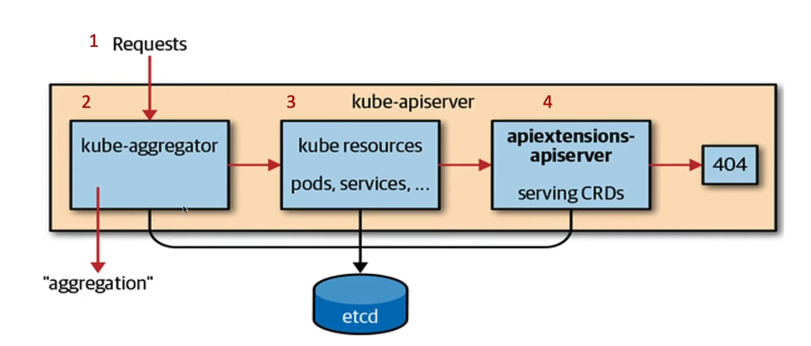

# Custom Resource Definations

## Resource
-   A resource is an endpoint in the **Kubernetes API** the stores colletion of **API Object**.

```sh
kubectl api-resources 
NAME  (RESOURCES)                   SHORTNAMES   APIVERSION                        NAMESPACED   KIND
componentstatuses                   cs           v1                                false        ComponentStatus
configmaps                          cm           v1                                true         ConfigMap
deployments                         deploy       apps/v1                           true         Deployment
nodes                               no           v1                                false        Node
persistentvolumeclaims              pvc          v1                                true         PersistentVolumeClaim
persistentvolumes                   pv           v1                                false        PersistentVolume
pods                                po           v1                                true         Pod
replicasets                         rs           apps/v1                           true         ReplicaSet
horizontalpodautoscalers            hpa          autoscaling/v2                    true         HorizontalPodAutoscaler
```
-   **apps/v1** is API Endpoint group
-   **Deployment** is resource - api Object

## Custom Resources
-   Customized Resources are extension of the Kubernetes API.
-   Resources which is not available by default.
-   Once custom resource is created, can access using kubectl.
-   Provides declarative API

## Defination
-   Declarative commands to API server is in form of YAML construct.


# How CRD will work in Kubernetes

[Kubernetes: SampleController](https://github.com/kubernetes/sample-controller).
- The **CustomResourceDefination** API resources allow you to define custom resource.
    - Define **CustomResouceDefination** using YAML
    - Create custom resources using YAML
- What really CRDs to work like Pods?
    - Once CRDs is created, Create new **Custom Controller** on resource handling create/delete/update events.
    - Build **CustomController & Deploy** to work CRD as **aggregatd** API for Declarative Resources using kubectl. 


```sh
kubectl apply -f crd.yaml
kubectl api-resources
NAME                                SHORTNAMES   APIVERSION                        NAMESPACED   KIND
componentstatuses                   cs           v1                                false        ComponentStatus
configmaps                          cm           v1                                true         ConfigMap
endpoints                           ep           v1                                true         Endpoints
greetings                           grt          vishnu.io/v1alpha1                true         Greeting
kubectl apply -f crd_example.yaml
```
