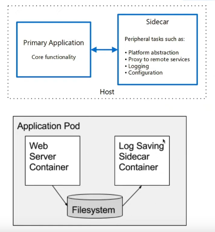
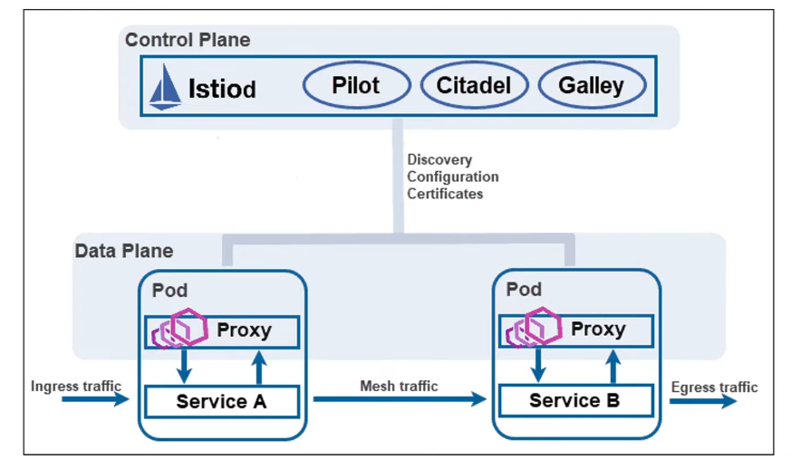

# ServiceMesh

## what is servicemesh?
- Dedicated infrstructure layer for facilitating service-to-service communications, optimize, fast, reliable and secure.
- **Configuratble**, low-latency infrstructure layer designed to handle a **high volume of network-based interposes** communication along applicaiton infrstructure service.
- The servicemesh usually implemented by providing a proxy instance, called a **sidecar**, for a each service instance.
- **Sidecars** handle interservice communications, monitoring, and security-related concerns- indeed, anything that can be abstracted awsay from the individual service.

- **ServiceDiscovery and LoadBalacing**
- **Intelligent Routing** decission to multiple services
- **Encryption** between service to service
- See services diagram and manage services.
- Monitor and Traces traffic between services.
- **Quickley Identify Issues** when mulitple NS and SVC's in cluster
- **Authuentication and Authorization** between services.
- Resiliency by adding policies
- Service Mesh is solutions, it **reside outside** of the application using Proxy pod
- By adding **Transparent Proxies** for Fault Tolerant Distributed Architectures.

### SideCar Container
- Extend the main container functionality without any impact



# ISTIO

-   **Popular & OpenSource** Service mesh for Kubernetes.
-   Service to Service communication
-   Greate Features
    - Traffice 
    - Security
    - Observability
-   Built using CRDs & Sidecar patterns
-   Started in May 2017 by Google, IBM and Lyft

## Traffic Management
- Traffic shifting, Request Routing, LoadBalancin, failovers with routing rules.
- Ingress & Egress
- Setup retries, Timeouts, circuit breakers, and fault injections.

## Security
- certificate management, TLS communication
- Access control, authorization, authentication & Enforce security policies.

## Observability / Network Resiliency
- Metrics, Logs, and Distributed Tracking

## Extensibility
- Custom policy enforcement and telemtry generation for mesh traffic.


## Architecture

### Two main components
- DataPlane: set of intelligent proxies (Envoy) for SVC to SVC
- Control Plan: Manages and configures the proxies to route traffic

### Envoy
- Proxy sidecar container

### Istiod
- Service Discovery
- Configuration
- Cert management

- Service mesh is a Pettern, Istio is an implementation. Control plane **manages, coverts configuration** of Envoy proxies.
- **Envoy Porxies**: open source and independent
- After configuration, envoy proxy is injected inot the pods.
- No need to Modify SVC or Deployment. When new SVC/EP is deployed, automatically detects and injects
- Apply only istio configration, Envory will automatically.

### Sidecar
- Communication config for network
- Security Settings
- Retry logic
- Metrics capabilities
- Tracing capbilities
- works as proxy

## 1. Traffic Splitting
- Virtual Service
    - Configration how to route service traffic to destination
- Destination Rules
    - Configure what should happen to traffic
- Gateways
    - Ingress gateway (alternative to nginx ingress)
    - Egress Gateway
- Service Entry
    - Redirect and forward traffic for external destination
    - Retry, Timout, Fault Injections
- SideCars
    - Fine-tune the set of ports and protocol of side cars
    - limit the set of services.

- Request Routing: route to 2 different micro services
- Fault Injection: to test the resiliency of application
- Traffic Shifting: canary- service v1 50% and service v2 50%
- Request Timeout: add artificial delay to timeout
- Circuit Breaker: limit failure, latency and proceed
- Mirroring: shadowing-copy live traffic
- locality Load balancing: diff regions & avail zones, failover/ weighted/ distributed
- Ingress Gateway: incomming traffic gateway

## 2. Security
- works as certificate authority
- it generates certificates to all microservices in cluster
    - Authentication policies
    - Authorization Policies
    - Secure naming info
- has Istio identity
    - K8s RBAC service account
    - GCP IAM service account
    - on-prem AD user ccount.

## 3. Observability
- Metrics
    - Proxy Level
    - Control Plane Level
- Distributed tracing
    - Request flow, latency
    - Tracing backend Zapkin, Jaeger
- Access Logs
    - service traffic in a configurable set of formats
    - How what when and where
kuberentes label: app:SomeName is must for metrics

## 4. Extensibilities
- WebAssembly is a sandbox technology which can be used to extend the Istio Proxy (Envoy). 
1. Filter Service Provider Interface (SPI)  
    - for building proxy-wasm plugin for filters
2. Sandbox
    - V8 WASM runtime embedded in Envoy
3. HostAPI
    - for header, tailers and metadata
4. Call out APIs
    - for gRPC and HTTP calls
5. State and Logging APIs
    - for metrics and monitorings


### Platform Setup on local environment
-   K3d
-   Kind
-   kops
-   MicroK8s
-   Minikube

### minikube - ISTIO
```sh
minikube start --memory=16384 --cpus=4 --kubernetes-version=v1.26.1
minikube ssh
top
exit
minikube tunnel (optional)

# istio installation
curl -L https://istio.io/downloadIstio | sh -
cd istio-1.24.1
export PATH=$PATH:$PWD/bin

istioctl install --set profile=demo -y

kubectl run web --image nginx -n default
kubectl get pods
kubectl label namespace default istio-injection=enabled
kubectl get ns --show-labels
kubectl delete po web
kubectl run web --image nginx -n default
```
